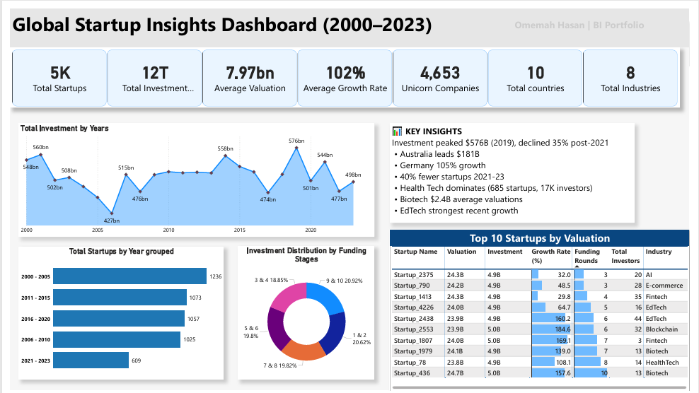
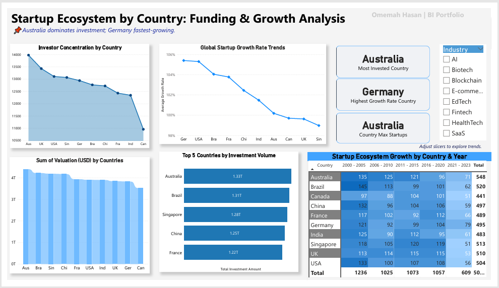
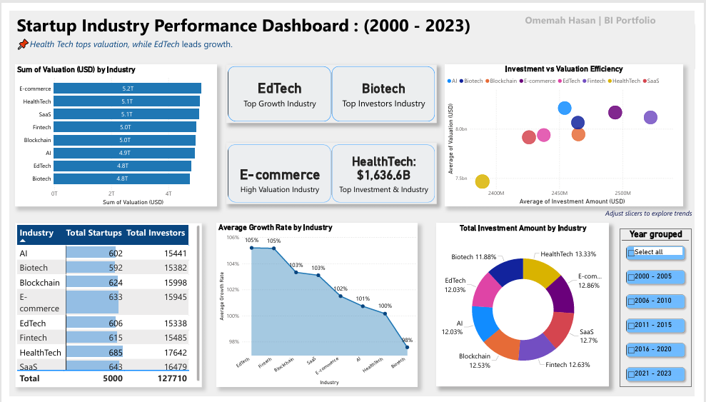

#  Startup Investment Analysis Dashboard

> **Quick Overview:** Analyzed $12T in global startup investments (2000–2023) across 5,000 companies and 10 countries. Built interactive Power BI dashboards revealing Australia’s top position in startup count (548) and investment volume and Germany with 105% growth rate , healthcare's $1.6T dominance, and post-2021 investment opportunities. Demonstrates end-to-end BI skills from data transformation to executive reporting.

## *$12T Global Investment Analysis | 5,000 Startups | 10 Countries | 8 Industries | 23 Years*

**Power BI Portfolio Project** | Business Intelligence | Investment Analytics | Data Storytelling

---

##  ABOUT THIS PROJECT

This project marks my return to data analytics after dedicated skill-building in Business Intelligence and Power BI.  
It showcases my ability to work with **large-scale datasets**, conduct **data transformation**, and produce **insight-driven dashboards** for real-world decision-making.

**Dataset Highlights:**
- Covers 2000–2023 investment landscape
- 10 countries | 5,000 startups | 8 industries
- $12T+ tracked investments from public sources
- Fully transformed and modeled for interactive analysis

---

## 📈 KEY INSIGHTS

- **Peak Funding:** $576B in 2019 → 35% decline post-2021, creating market entry opportunities  
- **Australia:** 584 startups, average $2.4B investment, leading market  
- **Germany:** 105% growth rate, fastest expanding  
- **Healthcare:** $1,636.6B invested | 685 startups | 17K investors  
- **EdTech:** Fastest growth sector despite startup count decline post-2021  
- **AI:** $8.2B average valuation, industry leader

---

##  BUSINESS VALUE DELIVERED

- **Strategic Intelligence:** Global trends across 8 industries  
- **Risk Analysis:** Timing and geographic risk indicators  
- **Opportunity Mapping:** High-growth sectors & emerging markets  
- **Investment Guidance:** Data-backed portfolio strategies

---

##  TECHNICAL SKILLS

| Skill Area              | Tools & Methods        | Deliverables Produced |
|-------------------------|------------------------|-----------------------|
| Business Intelligence   | Power BI, DAX          | 3 dashboards, drill-downs |
| Data Transformation     | Power Query M, Modeling| Expanded dataset (10→13 columns) |
| Analytics               | Trend, Statistical     | Growth forecasts, pattern detection |
| Visualization           | UI/UX dashboard design | Executive, analytical, operational |
| Domain Knowledge        | Startup Investments    | Sector-specific KPIs |

---

##  DASHBOARDS

**Executive Overview**  
  

**Investment Trends**  
  

**🌍 Market Intelligence**  
  

---

## 🎯 STRATEGIC RECOMMENDATIONS

- Focus on **Australia** (stability) & **Germany** (high growth)  
- Prioritize **Healthcare** (scale) & **EdTech** (momentum)  
- Post-2021 funding dip offers attractive entry points

---

##  TECHNICAL IMPLEMENTATION

**Workflow:**  
`Raw Data (5K rows, 10 cols) → Cleaning → Transformation → 13-column Analysis Model`  

**Highlights:**
- $12T investment records validated & standardized
- Currency normalization across 10 countries
- 3 calculated fields for deeper analytics
- Optimized Power BI model for speed

**Power BI Features:**
- DAX growth & YoY measures
- Dynamic filters, drill-through navigation
- Geo heat maps
- Time intelligence functions

---

##  PROJECT STRUCTURE
 Startup Investment Analysis
├── 📂 data/
│ ├── raw/ # Original dataset
│ └── processed/ # Cleaned, transformed dataset
├── 📂 images/dashboards/
├── 📂 powerbi-dashboard/
└── 📂 documentation/

##  ABOUT ME

**Omemah Hasan** | Aspiring Data Analyst  
🎓 **M.Tech Computer Science** (2022)  
💡 Specializing in **Business Intelligence, Investment Analytics, Data Visualization**  

📧 omemahhasan@gmail.com  |  [LinkedIn] |  https://github.com/omemahhasan-hub 

---

> *"Transforming 23 years of startup data into actionable investment intelligence"*

